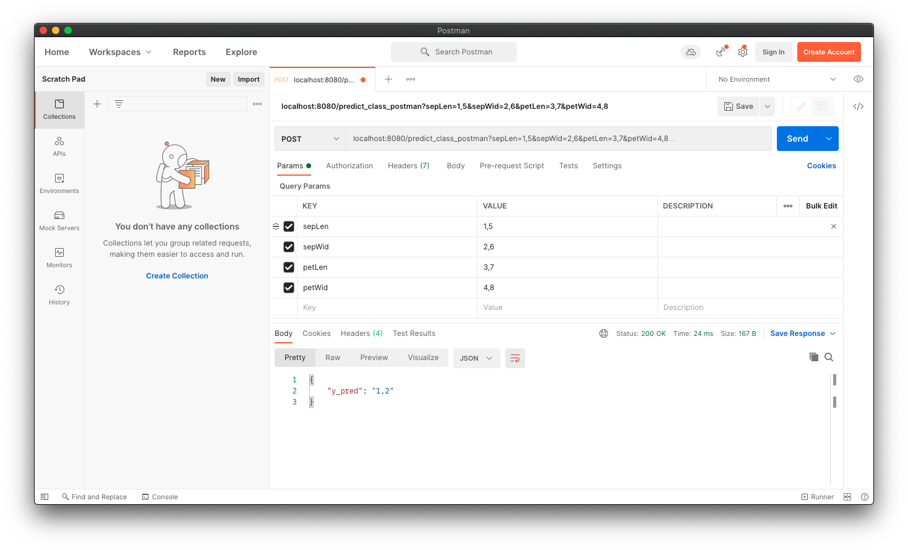
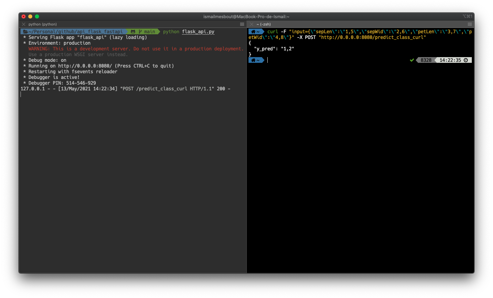
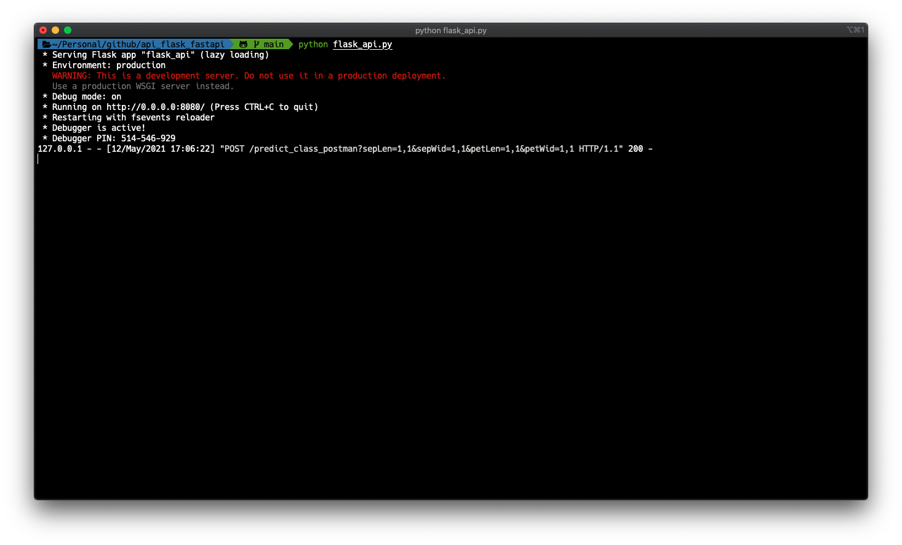
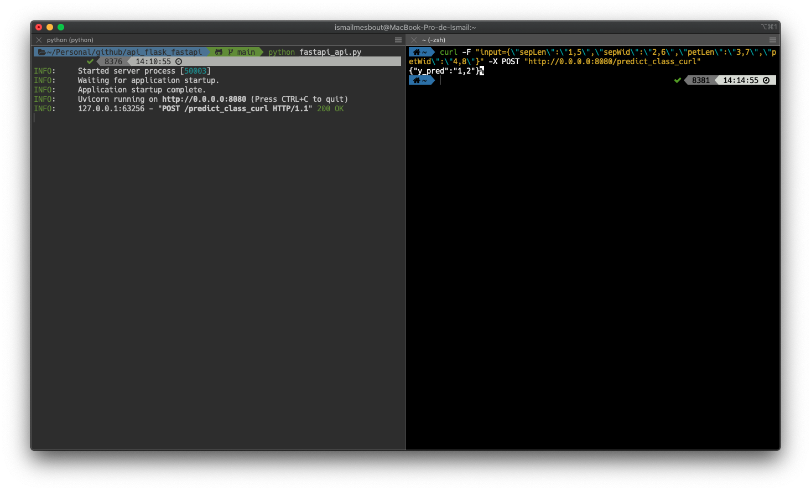

# APIs using Flask and FastAPI

> Deploy your ML model as an API using Flask or FastApi

<center></center>

In this repository, you will find the following scripts which will enable you to transform your Data Science project into a consumable API:

- `iris_model.ipynb`: a notebook hosting the training of the model on the iris dataset
- `flask_api.py`: a python script exposing your work into an API using Flask
- `fastapi_api.py`: similar to the previous script with the use of FastAPI

## 1 - Flask

[Flask](https://flask.palletsprojects.com/en/2.0.x/) is a python module developed to create APIs and expose their services on a given network. It can be installed using the following command-line:

```bash
pip install flask
```

In the following code, I will create a flask API that uses the previous trained model to predict the class of the irises given the four variables as inputs.

##### • Initializing the API

```python

#%%
from flask import Flask, request, jsonify
import pandas as pd
import joblib
import json

WEIGHTS_DIR = "weights/"
FLASK_API = Flask(__name__)

```

##### • Loading the model

```python
def get_iris_model():
    loaded_clf = joblib.load(WEIGHTS_DIR + "clf_iris.joblib")
    return loaded_clf

loaded_clf = get_iris_model()

def str_to_float_list(arg):
    arg = arg.split(",")
    arg = [float(x) for x in arg]
    return arg
```

##### • Routing:

When creating an API, **Routes** are used to exposed its functions and services. In flask, there are adding using decorators :

> @FLASK_API.route("/route", methods=[...])

**+ predict_class_postman**

When using Postman, we extract the variables using the **args** parameter of the **request**.
We create the route through which we will make the prediction. This route returns a json response with the corresponding class for each set of variables:

```python

#%%Postman
def get_params_postman(request):
    sep_length = str_to_float_list(request.args.get("sepLen"))
    sep_width = str_to_float_list(request.args.get("sepWid"))
    pet_length = str_to_float_list(request.args.get("petLen"))
    pet_width = str_to_float_list(request.args.get("petWid"))

    return (sep_length, sep_width, pet_length, pet_width)

@FLASK_API.route("/predict_class_postman", methods=["GET", "POST"])
def predict_class_postman():
    (sep_length, sep_width, pet_length, pet_width) = get_params_postman(request)
    new_row = pd.DataFrame(
        {
            "sepal length (cm)": [float(x) for x in sep_length],
            "sepal width (cm)": [float(x) for x in sep_width],
            "petal length (cm)": [float(x) for x in pet_length],
            "petal width (cm)": [float(x) for x in pet_width],
        }
    )
    y_pred = list(loaded_clf.predict(new_row))
    y_pred = [str(x) for x in y_pred]

    response = {"y_pred": ",".join(y_pred)}
    return jsonify(response)

```

**+ predict_class_curl**

We create another route this time to communicate with the CURL command. We extract the variables from the command-line using the method **form.get** of the sent **request**.

```python
#%%CURL
def get_params_curl(request):
    request_input = request.form.get("input")
    request_input = json.loads(request_input)

    sep_length = str_to_float_list(request_input["sepLen"])
    sep_width = str_to_float_list(request_input["sepWid"])
    pet_length = str_to_float_list(request_input["petLen"])
    pet_width = str_to_float_list(request_input["petWid"])

    return (sep_length, sep_width, pet_length, pet_width)


@FLASK_API.route("/predict_class_curl", methods=["GET", "POST"])
def predict_class_curl():
    (sep_length, sep_width, pet_length, pet_width) = get_params_curl(request)
    new_row = pd.DataFrame(
        {
            "sepal length (cm)": [float(x) for x in sep_length],
            "sepal width (cm)": [float(x) for x in sep_width],
            "petal length (cm)": [float(x) for x in pet_length],
            "petal width (cm)": [float(x) for x in pet_width],
        }
    )
    y_pred = list(loaded_clf.predict(new_row))
    y_pred = [str(x) for x in y_pred]

    response = {"y_pred": ",".join(y_pred)}
    return jsonify(response)

```

##### • Starting the service

Once we have defined all the elements above, we start the service of the API by adding the following code:

```python
#%%
if __name__ == "__main__":
    FLASK_API.debug = True
    FLASK_API.run(host="0.0.0.0", port="8080")
```

- The `debug mode` can be useful to instantly visualize the changes
- We can choose the `URL` and `port` on which the API is exposed:

To launch the API, type:

```bash
python flask_api.py
```

Where `flask_api.py` is the file hosting all the code developed above.

We get the following response:

```bash
>>> * Serving Flask app "flask_api" (lazy loading)
>>> * Environment: production
WARNING: This is a development server. Do not use it in a production deployment.
Use a production WSGI server instead.
>>> * Debug mode: on
>>> * Running on http://0.0.0.0:8080/ (Press CTRL+C to quit)
>>> * Restarting with fsevents reloader
>>> * Debugger is active!
>>> * Debugger PIN: 514-546-929
```

##### • Request & Response

**+ Postman**
Given the `HTTP request`on Postman:

> <center>

```http
localhost:8080/predict_class_postman?sepLen=1,5&sepWid=2,6&petLen=3,7&petWid=4,8
```

</center>

The response is the following:

```json
{
  "y_pred": "1,2"
}
```

<center></center>

**+ CURL**
We launch the following command-line using a curl to communicate with the api:

> <center>

```bash
curl -F "input={\"sepLen\":\"1,5\",\"sepWid\":\"2,6\",\"petLen\":\"3,7\",\"petWid\":\"4,8\"}" -X POST "http://0.0.0.0:8080/predict_class_curl"
```

</center>

<center></center>

As expected, we get the same results:

```bash
{
  "y_pred": "1,2"
}
```

**HTTP codes:** if the request is correct the API returns the HTTP code **200**. There exist other codes such as _4xx_ for client error and _5xx_ for server error.

<center></center>

---

## 2 - FastAPI

[FastAPI](https://fastapi.tiangolo.com/) is another python module that enables the development of APIs.
It can be installed using the command-line:

```bash
pip install fastapi
```

It is very similar to Flask with minor changes:

- **Query parameters** from `postman` are extracted using `request.query_params`
- **Form parameters** in `curls` are obtained using `eval(input)` where `input: str = Form(...)`

```python
#%%
import pandas as pd
import joblib
import json
from fastapi import FastAPI, Form, Request
import uvicorn

WEIGHTS_DIR = "weights/"
FASTAPI_API = FastAPI()

#%%
def get_iris_model():
    loaded_clf = joblib.load(WEIGHTS_DIR + "clf_iris.joblib")
    return loaded_clf


def str_to_float_list(arg):
    arg = arg.split(",")
    arg = [float(x) for x in arg]
    return arg


loaded_clf = get_iris_model()

#%%Postman
def get_params_postman(query_params):
    sep_length = str_to_float_list(query_params["sepLen"])
    sep_width = str_to_float_list(query_params["sepWid"])
    pet_length = str_to_float_list(query_params["petLen"])
    pet_width = str_to_float_list(query_params["petWid"])
    return (sep_length, sep_width, pet_length, pet_width)


@FASTAPI_API.post("/predict_class_postman")
def predict_class_postman(request: Request):
    query_params = dict(request.query_params)
    (sep_length, sep_width, pet_length, pet_width) = get_params_postman(query_params)
    new_row = pd.DataFrame(
        {
            "sepal length (cm)": [float(x) for x in sep_length],
            "sepal width (cm)": [float(x) for x in sep_width],
            "petal length (cm)": [float(x) for x in pet_length],
            "petal width (cm)": [float(x) for x in pet_width],
        }
    )
    y_pred = list(loaded_clf.predict(new_row))
    y_pred = [str(x) for x in y_pred]

    response = {"y_pred": ",".join(y_pred)}
    return response


#%%CURL
def get_params_curls(input_var):
    sep_length = str_to_float_list(input_var["sepLen"])
    sep_width = str_to_float_list(input_var["sepWid"])
    pet_length = str_to_float_list(input_var["petLen"])
    pet_width = str_to_float_list(input_var["petWid"])
    return (sep_length, sep_width, pet_length, pet_width)


@FASTAPI_API.post("/predict_class_curl")
def predict_class_curl(input: str = Form(...)):
    input_var = eval(input)
    (sep_length, sep_width, pet_length, pet_width) = get_params_curls(input_var)
    new_row = pd.DataFrame(
        {
            "sepal length (cm)": [float(x) for x in sep_length],
            "sepal width (cm)": [float(x) for x in sep_width],
            "petal length (cm)": [float(x) for x in pet_length],
            "petal width (cm)": [float(x) for x in pet_width],
        }
    )
    y_pred = list(loaded_clf.predict(new_row))
    y_pred = [str(x) for x in y_pred]

    response = {"y_pred": ",".join(y_pred)}
    return response

#%%
if __name__ == "__main__":
    uvicorn.run(FASTAPI_API, host="0.0.0.0", port=8080)
```

<!-- #%%
if __name__ == "__main__":
    uvicorn.run(FASTAPI_API, host="0.0.0.0", port=8080)
``` -->

<!-- [Uvicorn](https://www.uvicorn.org/) is a lightning-fast ASGI server implementation, using uvloop and httptools where uvloop is a Cython-based replacement for asyncio's event loop allowing 2-4 times faster than the default event loop.
Uvicorn can be installed using the following command-line:

```bash
pip install uvicorn
``` -->

To launch the API, type:

```bash
python fastapi_api.py
```

Where `fastapi_api.py` is the file hosting all the code developed above.

We get the following response:

```bash
>>> INFO:     Started server process [50003]
>>> INFO:     Waiting for application startup.
>>> INFO:     Application startup complete.
>>> INFO:     Uvicorn running on http://0.0.0.0:8080 (Press CTRL+C to quit)
```

##### • Request & Response

**+ Postman**
Given the HTTP request on Postman:

> <center>

```http
localhost:8080/predict_class_postman?sepLen=1,5&sepWid=2,6&petLen=3,7&petWid=4,8
```

</center>

The response is the following:

```json
{
  "y_pred": "1,2"
}
```

<center></center>

**+ CURL**
We launch the following command-line using a curl to communicate with the api:

> <center>

```bash
curl -F "input={\"sepLen\":\"1,5\",\"sepWid\":\"2,6\",\"petLen\":\"3,7\",\"petWid\":\"4,8\"}" -X POST "http://0.0.0.0:8080/predict_class_curl"
```

</center>

<center></center>

As expected, we get the same results with a **200** HTTP code::

```bash
{
  "y_pred": "1,2"
}
```
